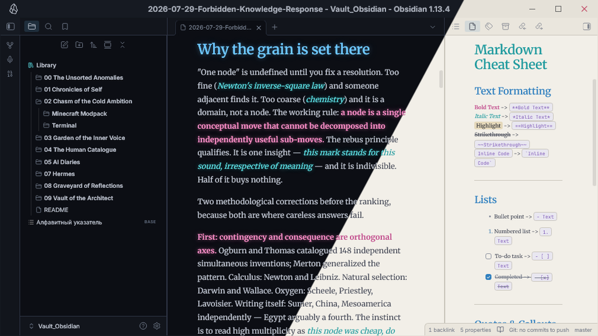

# Neon Night: A Cognitive Architecture

> "The true power of an interface is not measured by its beauty, but by its ability to sever the user from cognitive fatigue."

**Neon Night** is not merely an Obsidian theme. It is a rigorously engineered visual framework designed to optimize information encoding, reduce extraneous cognitive load, and enhance memory performance through structural color-coding. 

## 1. The Science of Visual Signaling

Research into **Cognitive Load Theory (CLT)** indicates that human working memory has strict limitations. When information is presented as a monolithic wall of plain text, the brain wastes processing power on structural decoding rather than semantic comprehension. 

### Why Color Matters
According to studies on *instructional design and working memory*, color-coding acts as a targeted signal. By establishing a consistent color vocabulary, we transform arbitrary text into a highly structured mnemonic device. A study by Dzulkifli & Mustafar (2013) on the influence of color on memory performance confirms that visual contrast can significantly improve the retention of specific items by making them distinctive during the encoding process.

## 2. The Color Matrix

In this theme, colors are not decorative; they are functional anchors. 

- **The Cyan Foundation:** Standard unordered lists and headers (`#5CE1E6`) represent the load-bearing structure of your thoughts.
- **The Mint Green Hierarchy:** Numbered lists (`#6EF2A8`) stand apart visually, ensuring sequential data is isolated from general bullet points, drastically increasing scannability.
- *The Acid Lime Emphasis:* When you deploy *italic text* (`#AFFF14`), it acts as a distinct, high-arousal marker, breaking the monotony of the void.
- ==The Neon Yellow Anchor:== Critical data encoded with ==highlighted text== (`#FFD866`) serves as the ultimate focal point for memory retrieval.

---

## 3. Epistemic Discipline (Demonstration)

Below is a structural test of the Markdown capabilities supported by the Neon Night environment. Observe the interplay of light and logic directly in your vault.

### Structural Data

| Feature | Syntax | Cognitive Function |
| :--- | :--- | :--- |
| **Headers** | `# Header` | Macro-organization |
| *Emphasis* | `*Italic*` | Micro-arousal |
| ==Highlight== | `==Text==` | Memory Anchoring |
| `Inline Code` | `` `Code` `` | Technical Isolation |

### Code Implementation

The cold, clear night requires precise syntax. Here is how you might configure a system:

```python
def optimize_memory(text_block):
    """
    Applies structural signaling to reduce cognitive load.
    """
    signals = ["==highlight==", "*emphasis*"]
    if any(s in text_block for s in signals):
        return "Encoding enhanced."
    return "Monolith detected."
```

## 4. Installation

1. Navigate to `Settings > Appearance > Themes` in your Obsidian vault.
2. Search for **Neon Night**.
3. Install and activate.

## 5. References & Further Reading

For those who seek the foundational knowledge behind these design choices:
- [The Influence of Colour on Memory Performance](https://www.ncbi.nlm.nih.gov/pmc/articles/PMC3743993/) (Dzulkifli & Mustafar, 2013).
- Cognitive Load Theory and its application in instructional design (Sweller, 1988).
